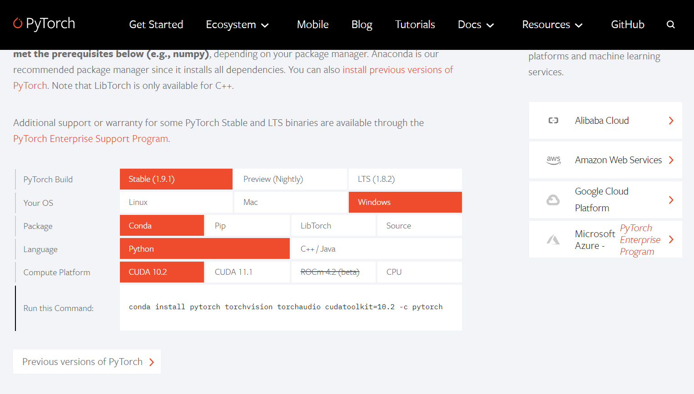
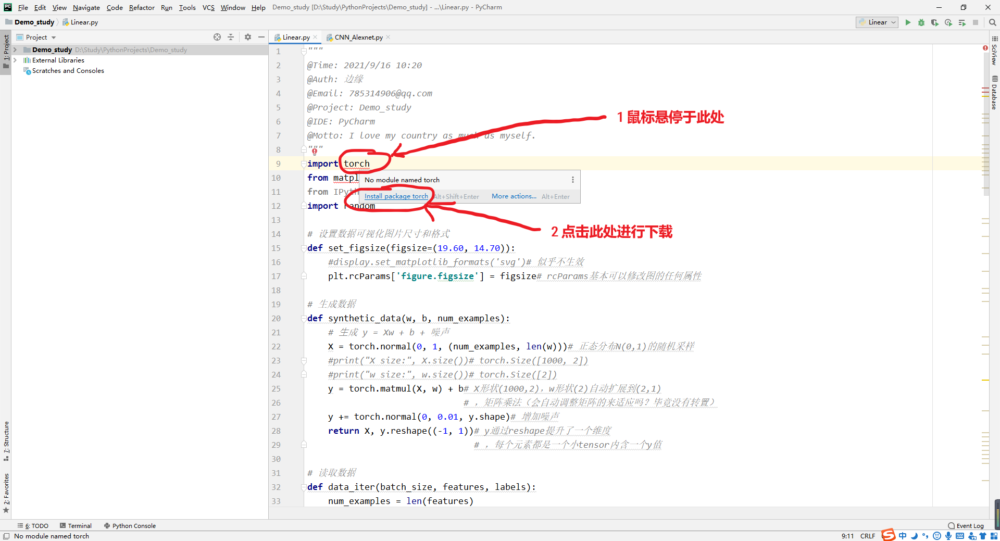
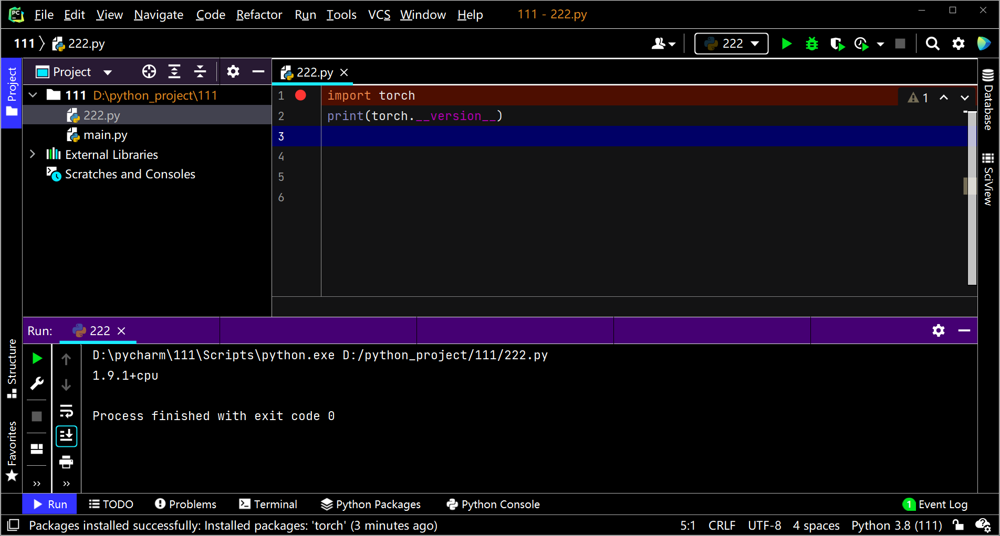

## pytorch 是什么？

pytorch 是使用 GPU 和 CPU 加速张量（Tensor）计算的库（如 numpy 是使用 CPU 加速 array 计算的库）。

张量（Tensor）：张量是 pytorch 最基本的计算数据类型，在数学上，张量是矩阵的推广。（就如同标量的推广是向量，向量的推广是矩阵）

## pytorch 安装

下面介绍两种下载方法。懒人或者方法一下载失败可以选择方法二，但方法二仅支持 Pycharm。

### 方法一

在 [Pytorch官网](https://pytorch.org/) 查询相关指令，如下图所示。

在 Pycharm 的 Terminal 终端输入指令（Anaconda 则是在 Anaconda Prompt 控制台）即可安装。

### 方法二

在 Pycharm 的任意 Python 文件中输入 `import torch`，Pycharm有检错机制，鼠标停留点击下载。

### 测试是否下载成功

运行代码 `import torch`，不报错即为下载成功。

运行代码 `print(torch.__version__)`，如果下载成功则会输出 pytorch 当前版本号。

感谢室友极不优美的命名方式的图例hh。

