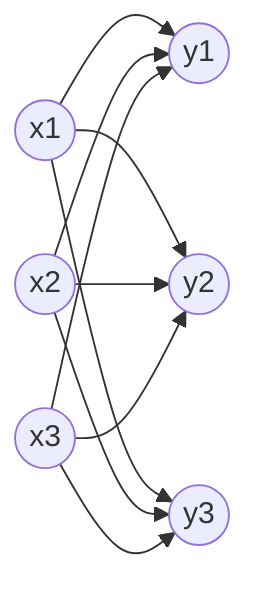

# 数学推导

## 1 损失函数

### 1.1 交叉熵损失函数

交叉熵损失函数有良好的可微分性质，使用梯度下降算法时相较其他损失函数收敛更快。
		softmax交叉熵损失函数

## 2 激活函数

### 2.1 softmax 函数

softmax 函数（通常用于多分类神经网络）将 n 个神经元的输出，映射到（0, 1）区间内，可以看成概率来理解。

使用 softmax 函数作为激活函数的主要原因：使得交叉熵损失函数的梯度求导变得容易。

该知识点参考[知乎忆臻的专栏文章](https://zhuanlan.zhihu.com/p/25723112)

### 2.2

### 2.3 

